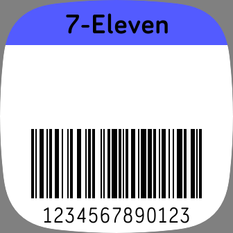

# Barcodes app for Fitbit Versa 3/Sense

Features:
- Customize the color of each barcode
- Customize the name of each barcode
- Supports ascii characters in the barcode
- Supports EAN-13 (hence UPC-A), Code-128 and Code-39 standards
- Store up to 5 barcodes
- Cycle through barcodes by tapping the screen between the barcode and title
- Direct link to app store (open with phone):
https://gallery.fitbit.com/details/58726c9d-92b2-4a76-b7f0-5f591c27cdf0
